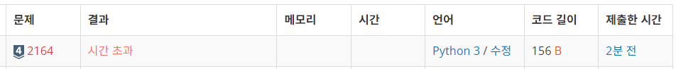
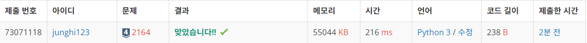

# [백준] 2164 카드2
문제 링크 : https://www.acmicpc.net/problem/2164

|시간 제한 | 메모리 제한 |	제출 |	정답 | 맞힌 사람 |	정답 비율 |
|---------|-----------|---------|---------|---------|---------|
|2초(추가 시간 없음) |	128 MB | 111988 |	58156 |	45324 |	50.945%|


## 💡 내가 푼 코드
```python
import sys

N = int(sys.stdin.readline())
card = [a for a in range(1, N+1)]

while len(card)>1:
    del card[0]
    card.append(card.pop(0))

print(card[0])
```
- 문제 그대로 따라서 풀었고, 제출했으나 시간 초과가 떴다.
- 코드는 문제 없이 돌아갔고, 정답도 잘 나왔다.
- `input()`이 아닌 `sys.stdin.readline()`으로 풀었는데 왜 시간초과가 떴을까?




## 💡 시간 복잡도
### 데크 사용
데크란?

큐의 양방향 버전을 얘기한다. 큐는 FIFO(First In First OUT) 이다. 한 방향으로 삽입되는 반면에 데크는 양방향에서 삽입, 삭제할 수 있다.

- 양 끝 엘리먼트의 `append()`, `pop`이 압도적으로 빠르다.
- 삽입, 삭제의 시간복잡도 O(1)로 매우 짧다. (리스트는 O(n))

데크 예시코드
```python
from collecitons import deque

deq = deque()

# 처음에 삽입
deq.appendleft()

# 끝에 삽입
deq.append(0)

# 처음 값 pop
deq.popleft()

# 끝 값 pop
deq.pop()
```

## 💡 수정 코드
```python
import sys
from collections import deque

N = int(sys.stdin.readline())
card = deque([a for a in range(1, N+1)])

while len(card)>1:
    card.popleft() #del card[0]
    card.append(card.popleft()) #card.append(card.pop(0))

print(card[0])

```
